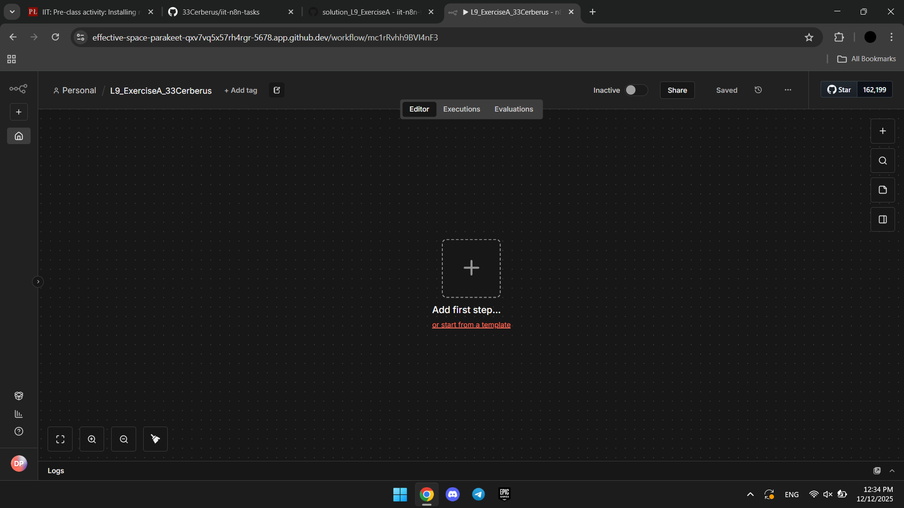
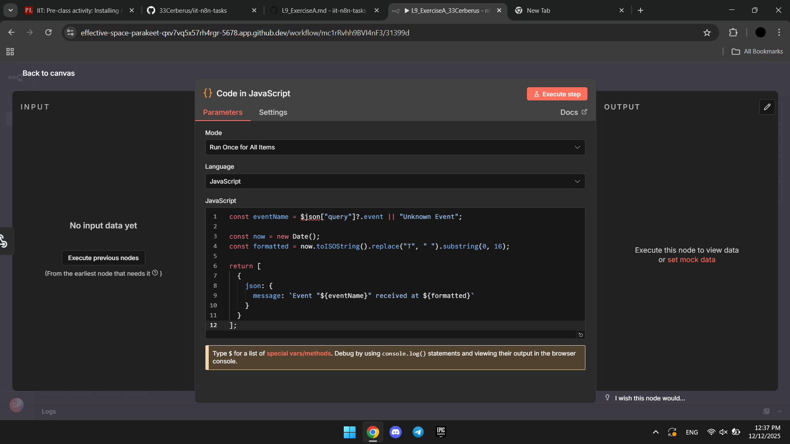
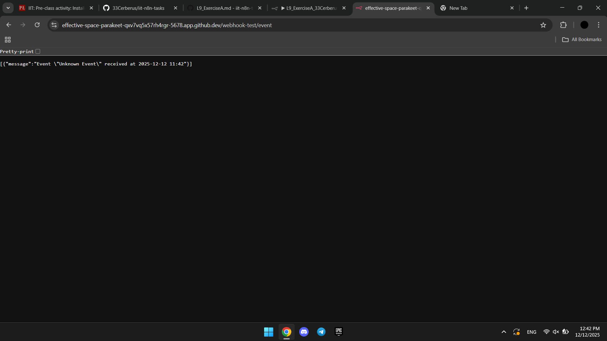

For this exercise I installed n8n to my CodeSpaces, than I configured my newly created workflow. After that, following the instructions I added webhook, code and webhook response nodes, also cofigurated them approperatly. And finally, I executed the workflow.

Newly created workflow: 
Code node configuration: 
Webhook response configuration: 
Workflow execution result: 