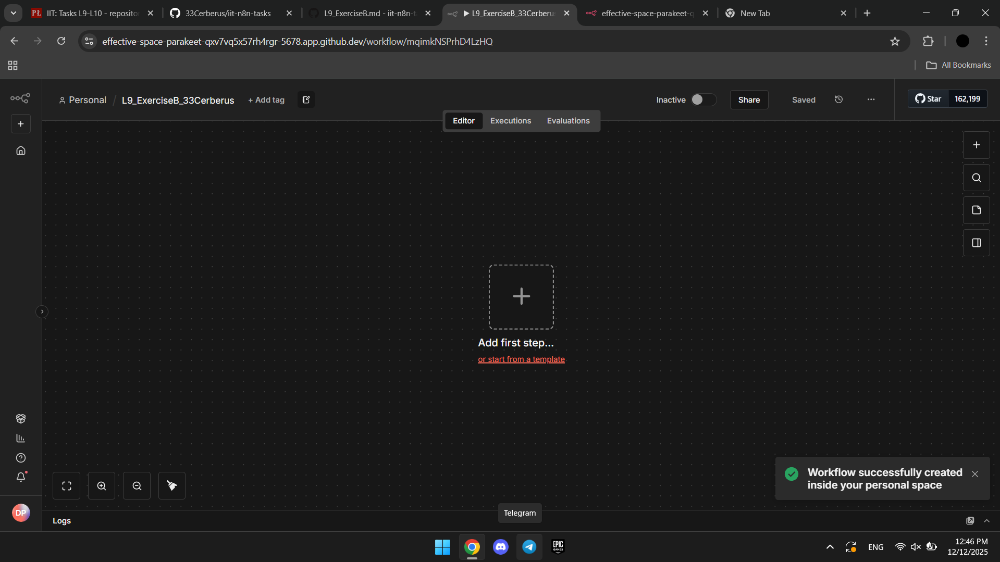
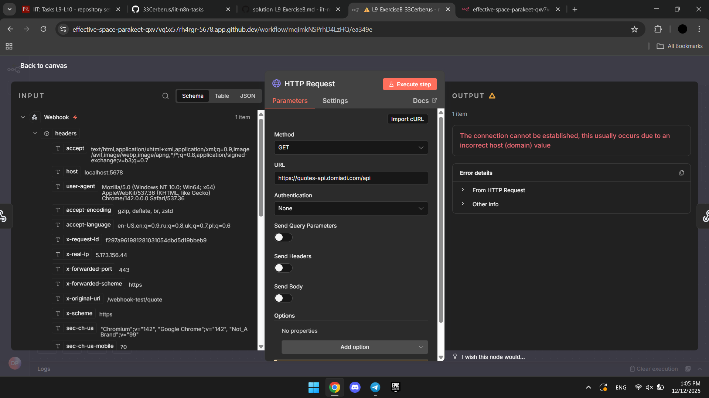
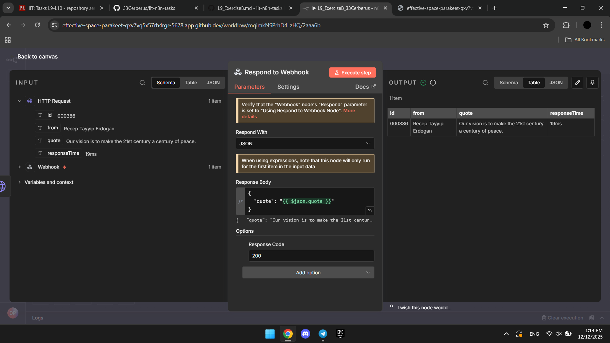
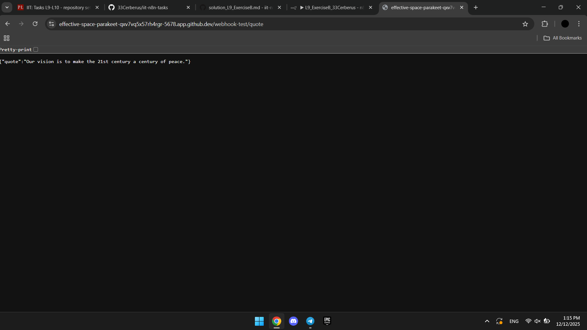

One more time, I created new workflow, added and configurated nodes. Then just show the result of http request

Newely created workflow: 
Request HTTP configuration: 
Respond to Webhook configuration: 
Execution result: 