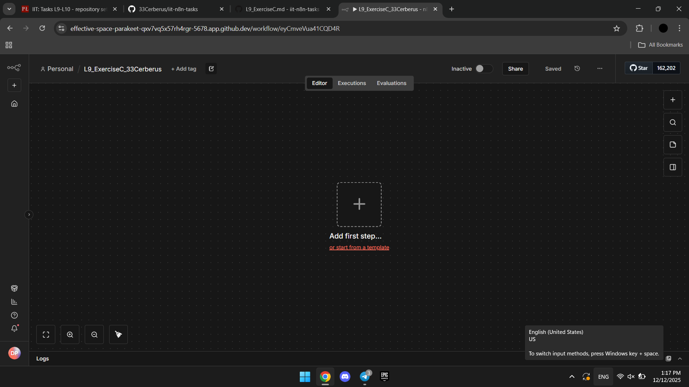
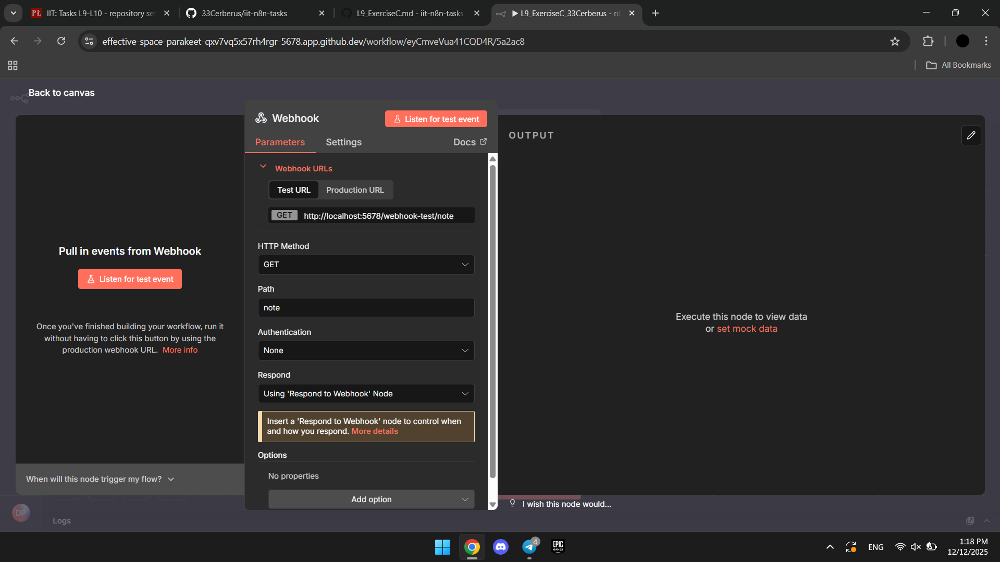
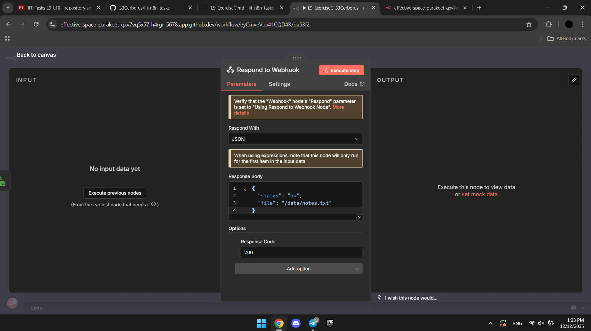
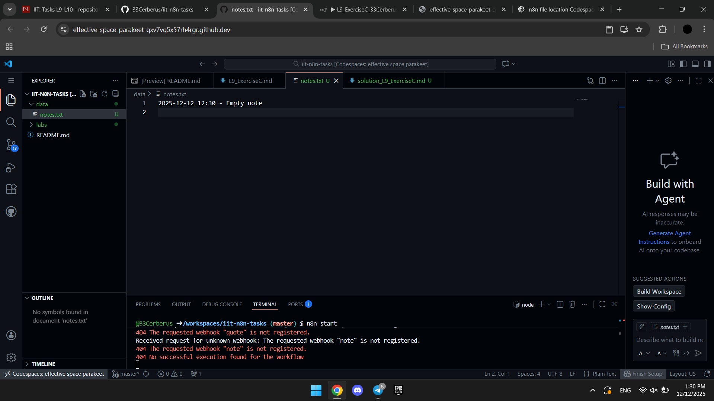

Created new workflow, configurated nodes. Then created a data folder and ran the workflow

Newely created workflow: 
Webhook node configuration: 
Webhook response node configuration: 
Notes content: 